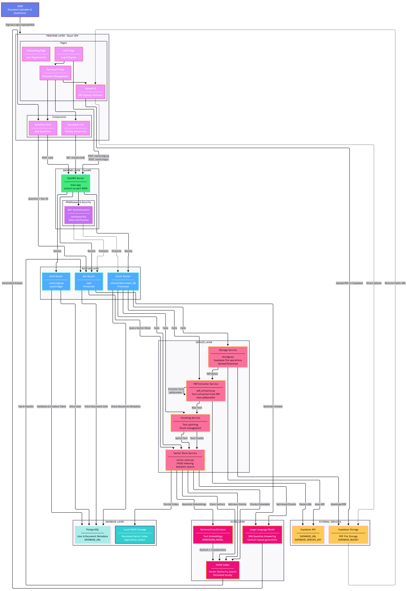

# 📄 DocuScope AI

> An open-source document reasoning web application that enables secure PDF upload, semantic search, and question answering using Retrieval-Augmented Generation (RAG).

**DocuScope AI** allows users to upload PDFs, extract and chunk text, store embeddings in a FAISS vector index, and ask questions scoped to a document using an LLM.  
The project consists of a **FastAPI backend** and a **React frontend**, designed to be modular, extensible, and easy to deploy.

---

## 🚀 What This Project Does

DocuScope AI provides an end-to-end document intelligence pipeline:

- Secure user authentication
- PDF upload and storage via Supabase
- Text extraction from PDFs
- Chunking and embedding using SentenceTransformers
- FAISS-based semantic vector search
- Question answering using retrieved chunks + LLM (RAG)
- React-based UI for onboarding, uploads, and Q&A

---

## 🏗 System Architecture



---

## ✨ Features

- 🔐 Secure signup and login
- 📤 Upload PDFs to Supabase storage
- 📄 Extract text from PDFs
- ✂️ Chunk documents and build FAISS vector indexes
- 🔎 Semantic search over document chunks
- 🤖 Ask questions scoped to a document (RAG)
- 🧭 React frontend with dashboard and upload UI

---

## 🧱 Repository Layout

```txt
backend/
 ├── app/
 │   ├── main.py
 │   ├── core/
 │   ├── services/
 │   │   ├── pdf_extractor.py
 │   │   ├── storage.py
 │   │   └── vector_store.py
 │   └── routers/
 │       ├── auth.py
 │       ├── chunk.py
 │       └── ask.py
 ├── requirements.txt
 └── .env

frontend/
 ├── src/
 ├── public/
 └── package.json
````

---

## 🛠 Requirements

### Backend

* Python **3.10+**
* FastAPI
* FAISS
* PyTorch
* sentence-transformers
* pdfplumber
* uvicorn

(See `backend/requirements.txt` for the full list.)

### Frontend

* Node.js **18+**
* npm or yarn
* Create React App

### External Services

* **Supabase**

  * Storage bucket for PDFs
  * API URL and service key

---

## 🔑 Environment Variables

Create a `.env` file in the **backend** directory with at least:

```env
SUPABASE_URL=
SUPABASE_SERVICE_KEY=
SUPABASE_BUCKET=
DATABASE_URL=
JWT_SECRET=
```

> Ensure the Supabase service key has permission to download files from the storage bucket.

---

## ▶️ Backend — Setup & Run

### 1. Create and Activate Virtual Environment

```bash
python -m venv .venv
source .venv/bin/activate      # macOS / Linux
.venv\Scripts\activate        # Windows
```

### 2. Install Dependencies

```bash
pip install -r backend/requirements.txt
```

### 3. Configure Environment

* Create `.env` with Supabase and DB credentials

### 4. Run FastAPI Server

```bash
uvicorn backend.app.main:app --reload --host 127.0.0.1 --port 8000
```

The API will be available at:

```
http://127.0.0.1:8000
```

---

## ▶️ Frontend — Setup & Run

```bash
cd frontend
npm install
npm start
```

The frontend runs at:

```
http://localhost:3000
```

By default, it connects to the backend at `http://127.0.0.1:8000`.

---

## 🔄 Minimal Usage Flow

1. **Sign up**

   * `POST /auth/signup`

2. **Login**

   * `POST /auth/login`
   * Receive JWT access token

3. **Upload PDF**

   * Frontend uploads file to Supabase
   * Stores public URL and document metadata

4. **Chunk Document**

   * `GET /chunk/{document_id}`
   * Extracts text, chunks it, and builds FAISS index

5. **Ask Questions**

   * `POST /ask`
   * Retrieves relevant chunks and generates an answer via LLM

---

## 📡 API Reference (Summary)

### 🔐 Signup

**POST** `/auth/signup`

```json
{
  "email": "jane@example.com",
  "name": "Jane Doe",
  "password": "s3cret"
}
```

**Response**

```json
{
  "access_token": "<jwt-token>"
}
```

---

### 🔐 Login

**POST** `/auth/login`

```json
{
  "email": "jane@example.com",
  "password": "s3cret"
}
```

---

### ✂️ Chunk Document

**GET** `/chunk/{document_id}`
Headers:

```
Authorization: Bearer <token>
```

**Response**

```json
{
  "status": "ok",
  "chunks_created": 42
}
```

---

### ❓ Ask Document

**POST** `/ask`

Headers:

```
Authorization: Bearer <token>
```

```json
{
  "document_id": "123",
  "question": "What is the project deadline?"
}
```

**Response**

```json
{
  "answer": "The project deadline is March 31, 2024."
}
```

---

## 🧠 Implementation Notes

* FAISS index and embeddings are stored under the backend vector store directory
* Embedding model and paths are configurable in:

  ```
  backend/app/services/vector_store.py
  ```
* PDF extraction expects Supabase **public URLs**
* Supabase service key must allow file downloads
* Frontend API base URL can be updated if backend host changes

---

## 🛠 Troubleshooting

* **FAISS / PyTorch install issues**

  * May require platform-specific wheels
  * Refer to FAISS documentation if `pip install` fails

* **Supabase download errors**

  * Verify public URL format
  * Check service key permissions
  * `pdf_extractor` raises errors on invalid URLs

---

## 🤝 Contributing

Contributions are welcome!

* Open issues for bugs or feature requests
* Submit PRs for improvements or refactors
* Keep `pdf_extractor`, `vector_store`, and API routers in sync when making changes


---

⭐ If you find DocuScope AI useful, consider starring the repository!

